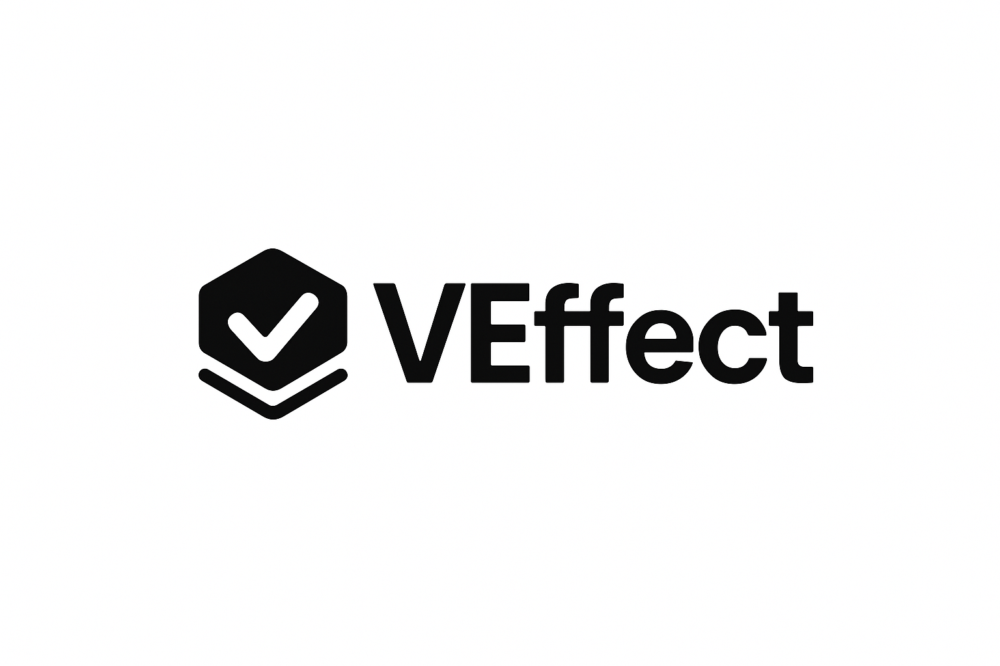

<div align="center">
  
</div>

<div align="center">  
  
  
  
  
</div>

## 🌟 Overview

**VEffect Validation** is a powerful TypeScript validation library built on the robust foundation of [Effect](https://effect.website), combining exceptional type safety, high performance, and developer experience. Taking inspiration from Effect's functional principles, VEffect delivers a balanced approach that excels at all three.

- **🔒 Best-in-class Type Safety**: Achieve end-to-end type inference from schema to validated data without TypeScript gymnastics.
- **🚀 Superior Performance**: Built on functional principles with optimized validation paths that leverage Effect's optimized architecture.
- **💎 Outstanding DX**: Intuitive, chainable API that's easy to learn yet powerful enough for complex validation scenarios.
- **⚙️ Effect-Powered**: Harnesses the power of Effect's functional approach for reliable, predictable validations.
- **🔧 Extensible**: Create custom validators, transformations, and error messages with ease.

**Completely free and open source** under the MIT license, VEffect Validation provides enterprise-grade validation for projects of any size without compromising on quality or performance.

## 📋 Contents

- [Features](#-features)
- [Installation](#-installation)
- [Core Concepts](#-core-concepts)
- [Basic Usage](#-basic-usage)
- [Schema Types](#-schema-types)
  - [Primitive Types](#primitive-types)
  - [Complex Types](#complex-types)
  - [Special Types](#special-types)
  - [Composition Types](#composition-types)
  - [Extended Types](#extended-types)
- [Schema Methods](#-schema-methods)
- [Enhanced String Validation Features](#-enhanced-string-validation-features)
  - [CIDR Notation Validation](#cidr-notation-validation)
  - [Base64 Validation](#base64-validation)
  - [Date and Time Validation](#date-and-time-validation)
  - [Specialized String Formats](#specialized-string-formats)
  - [Datetime Validation](#datetime-validation)
- [Advanced Features](#-advanced-features)
- [Error Handling](#-error-handling)
- [Type Inference](#-type-inference)
- [Registry System](#-registry-system)
  - [Basic Registry Operations](#basic-registry-operations)
  - [Utility Functions](#registry-utility-functions)
  - [Example Validation](#example-validation)
  - [Multiple Registries](#multiple-registries)
  - [Documentation Generation](#documentation-generation)
- [Examples](#-examples)
- [Contributing](#handshake-contributing)
- [Troubleshooting](#anger-troubleshootings)
- [Show Your Support](#heart-show-your-support)
- [Author](#robot-author)

## ✨ Features

- **🔍 Type-Safe** - Full TypeScript integration with inferred types
- **⚡ High Performance** - Built on a functional core for speed and reliability
- **🛡️ Comprehensive Validation** - Rich set of validators for common use cases
- **🧩 Composable** - Build complex schemas from simple building blocks
- **🔄 Functional** - Clean API that encourages immutable operations
- **💬 Detailed Errors** - Helpful error messages with path tracking
- **🔀 Pattern Matching** - Dynamic schema selection based on input values
- **⚖️ Discriminated Unions** - First-class support for TypeScript's discriminated unions
- **📚 Schema Registry** - Store and manage schemas with metadata
- **🧬 Interface Schema** - Powerful schema with explicit key optionality
- **🔄 Recursive Types** - True type-safe recursive structures without type assertions
- **🔄 Key vs Value Optionality** - Clear distinction between optional keys and optional values

## 🚀 Installation

```bash
npm install veffect
```

## 🧠 Core Concepts

VEffect provides a straightforward approach to validation:

1. **Create a schema** - Define the shape and constraints of your data
2. **Generate a validator** - Convert your schema into a validator
3. **Validate data** - Use the validator to check if data conforms to your schema

## 🔰 Basic Usage

```typescript
import { object, string, number } from "veffect";

// Define a schema
const userSchema = object({
  name: string().minLength(2).maxLength(50),
  age: number().min(18).max(120),
});

// Create a validator
const validator = userSchema.toValidator();

// Validate data
const validResult = validator.safeParse({
  name: "Alice",
  age: 30,
});
// { success: true, data: { name: "Alice", age: 30 } }

const invalidResult = validator.safeParse({
  name: "B",
  age: 16,
});
// {
//   success: false,
//   error: {
//     _tag: 'ObjectValidationError',
//     message: 'Object validation failed',
//     errors: [
//       {
//         _tag: 'StringValidationError',
//         message: 'String must be at least 2 characters',
//         path: ['name']
//       },
//       {
//         _tag: 'NumberValidationError',
//         message: 'Number must be at least 18',
//         path: ['age']
//       }
//     ]
//   }
// }
```

## 📊 Schema Types

### Primitive Types

#### String Schema

```typescript
import { string } from "veffect";

// Basic string validation
const nameSchema = string();

// String with constraints
const usernameSchema = string()
  .minLength(3)
  .maxLength(20)
  .regex(/^[a-zA-Z0-9_]+$/);

// Email validation
const emailSchema = string().email();

// URL validation
const websiteSchema = string().url();

// UUID validation
const idSchema = string().uuid();

// Enhanced string validations
// CIDR validation (IP network ranges)
const networkSchema = string().cidr(); // Validates both IPv4 and IPv6 CIDR notation
const ipv4NetworkSchema = string().cidr({ version: "v4" }); // IPv4 CIDR only
const ipv6NetworkSchema = string().cidr("v6"); // IPv6 CIDR only (string param)

// Base64 validation
const base64Schema = string().base64(); // Standard base64
const urlSafeBase64Schema = string().base64({ urlSafe: true }); // URL-safe base64
const flexibleBase64Schema = string().base64({ padding: false }); // Optional padding

// Date validation (YYYY-MM-DD)
const dateSchema = string().date();

// Time validation (HH:MM:SS[.sss])
const timeSchema = string().time();
const preciseTimeSchema = string().time({ precision: 3 }); // Requires exactly 3 decimal places

// ISO 8601 Duration validation
const durationSchema = string().duration(); // E.g., "P1Y2M3DT4H5M6S"

// Emoji validation
const emojiSchema = string().emoji();

// Nanoid validation (URL-friendly identifiers)
const nanoidSchema = string().nanoid();

// Datetime validation
const dateSchema = string().datetime();
const isoDateSchema = string().datetime({ precision: 3 });

// String validation with other methods
const pathSchema = string().startsWith("/").includes("api");
const codeSchema = string().endsWith(".ts").nonempty();

// String transformations
const normalizedEmailSchema = string().email().toLowerCase().trim();
```

#### Number Schema

```typescript
import { number } from "veffect";

// Basic number validation
const ageSchema = number();

// Number with constraints
const percentSchema = number().min(0).max(100);

// Integer validation
const countSchema = number().integer();

// Sign constraints
const positiveSchema = number().positive(); // > 0
const negativeSchema = number().negative(); // < 0
const nonnegativeSchema = number().nonnegative(); // >= 0
const nonpositiveSchema = number().nonpositive(); // <= 0

// Multiple of validation
const evenSchema = number().multipleOf(2);
const quarterSchema = number().step(0.25); // step is alias for multipleOf

// Other validations
const finiteSchema = number().finite();
const safeSchema = number().safe();
const portSchema = number().port(); // validates 1-65535 range for network ports

// Refinement with custom message
const evenNumberSchema = number()
  .integer()
  .refine((n) => n % 2 === 0, "Number must be even");
```

#### Boolean Schema

```typescript
import { boolean } from "veffect";

// Basic boolean validation
const isActiveSchema = boolean();

// With refinement
const termsAcceptedSchema = boolean().refine(
  (val) => val === true,
  "Terms must be accepted"
);
```

#### BigInt Schema

```typescript
import { bigint } from "veffect";

// Basic BigInt validation
const bigIntSchema = bigint();

// With constraints
const positiveSchema = bigint().positive(); // Only positive BigInts (> 0)
const nonNegativeSchema = bigint().nonNegative(); // Zero or positive BigInts (>= 0)
const rangeSchema = bigint().min(BigInt(10)).max(BigInt(100));
const multipleSchema = bigint().multipleOf(BigInt(5));

// Converting strings to BigInt
const fromStringSchema = bigint().fromString();
const result = fromStringSchema.toValidator().safeParse("12345");
// { success: true, data: 12345n }

// Refinements
const evenSchema = bigint().refine(
  (n) => n % BigInt(2) === BigInt(0),
  "BigInt must be even"
);

// Practical example: User with balance
const userSchema = object({
  id: string(),
  username: string().minLength(3).maxLength(20),
  balance: bigint().nonNegative(),
});

// Large number handling
const LARGE_BIGINT = BigInt("1234567890123456789012345678901234567890");
// BigInts can represent numbers of arbitrary precision, unlike regular numbers
```

#### Symbol Schema

```typescript
import { symbol } from "veffect";

// Basic Symbol validation
const symbolSchema = symbol();

// Symbols as unique identifiers
const ADMIN_ROLE = Symbol("ADMIN");
const USER_ROLE = Symbol("USER");

// Validation with symbols
const roleSchema = symbol();
const validator = roleSchema.toValidator();

// Valid: Symbols pass validation
const adminResult = validator.safeParse(ADMIN_ROLE);
// { success: true, data: Symbol(ADMIN) }

// Invalid: Non-Symbol values fail validation
const invalidResult = validator.safeParse("ADMIN");
// {
//   success: false,
//   error: {
//     _tag: 'TypeValidationError',
//     message: 'Expected a symbol, received string',
//     expected: 'symbol',
//     received: 'string'
//   }
// }

// Practical example: Using Symbols for role-based access control
function checkAccess(role: symbol) {
  roleSchema.toValidator().parse(role); // Validate symbol type

  if (role === ADMIN_ROLE) {
    return "Admin access granted";
  } else if (role === USER_ROLE) {
    return "User access granted";
  }
  return "Access denied";
}
```

#### Null Schema

```typescript
import { nullType } from "veffect";

// Null validation
const nullSchema = nullType();
const validator = nullSchema.toValidator();

// Valid: only null passes
const validResult = validator.safeParse(null);
// { success: true, data: null }

// Invalid: undefined, false, 0, "" all fail
const invalidResult = validator.safeParse(undefined);
// {
//   success: false,
//   error: {
//     _tag: 'TypeValidationError',
//     message: 'Expected null, received undefined',
//     expected: 'null',
//     received: 'undefined'
//   }
// }

// Practical example: Explicit null field
const userSchema = object({
  id: string(),
  email: string().email(),
  phoneNumber: nullType(), // Must be explicitly null (not undefined)
});
```

#### Undefined Schema

```typescript
import { undefinedType } from "veffect";

// Undefined validation
const undefinedSchema = undefinedType();
const validator = undefinedSchema.toValidator();

// Valid: only undefined passes
const validResult = validator.safeParse(undefined);
// { success: true, data: undefined }

// Invalid: null, false, 0, "" all fail
const invalidResult = validator.safeParse(null);
// {
//   success: false,
//   error: {
//     _tag: 'TypeValidationError',
//     message: 'Expected undefined, received object',
//     expected: 'undefined',
//     received: 'object'
//   }
// }

// Practical example: State transition
const taskSchema = object({
  id: string(),
  title: string(),
  completedAt: undefinedType(), // Must be explicitly undefined
});

// Later transitions to:
const completedTaskSchema = object({
  id: string(),
  title: string(),
  completedAt: string().datetime(), // Now must have a date
});
```

#### Void Schema

```typescript
import { voidType } from "veffect";

// Void validation (accepts undefined)
const voidSchema = voidType();
const validator = voidSchema.toValidator();

// Valid: only undefined passes
const validResult = validator.safeParse(undefined);
// { success: true, data: undefined }

// Invalid: null and all other values fail
const invalidResult = validator.safeParse(null);
// {
//   success: false,
//   error: {
//     _tag: 'TypeValidationError',
//     message: 'Expected void (undefined), received object',
//     expected: 'void',
//     received: 'object'
//   }
// }

// Practical example: Function return type
interface LoggerConfig {
  log: (message: string) => void; // Function returns nothing
}

const loggerSchema = object({
  log: pattern((input) => {
    if (typeof input === "function") {
      return any().refine(
        () => true, // We can't validate the return type at runtime
        "Must be a function returning void"
      );
    }
    return invalid("Must be a function");
  }),
});
```

#### Unknown Schema

```typescript
import { unknown } from "veffect";

// Unknown validation (type-safe alternative to any)
const unknownSchema = unknown();
const validator = unknownSchema.toValidator();

// Valid: all values pass validation
const stringResult = validator.safeParse("hello"); // { success: true, data: "hello" }
const numberResult = validator.safeParse(123); // { success: true, data: 123 }
const objectResult = validator.safeParse({}); // { success: true, data: {} }

// Unlike any, unknown requires type checking before operations
function processData(data: unknown) {
  // Validate with unknown schema
  const validData = unknownSchema.toValidator().parse(data);

  // Need explicit type checks before operations
  if (typeof validData === "string") {
    return validData.toUpperCase();
  } else if (typeof validData === "number") {
    return validData * 2;
  } else {
    return "Unknown data type";
  }
}

// Practical example: External API data
const apiResponseSchema = unknown();
// Later refinement after receiving data
function handleApiResponse(data: unknown) {
  const response = apiResponseSchema.toValidator().parse(data);

  // Type narrowing for safety
  if (typeof response === "object" && response !== null && "data" in response) {
    // Process response.data...
    return "Valid API response";
  }

  return "Invalid API response format";
}
```

#### Never Schema

```typescript
import { never } from "veffect";

// Never validation (rejects all values)
const neverSchema = never();
const validator = neverSchema.toValidator();

// Invalid: all values fail validation
const result = validator.safeParse("anything");
// {
//   success: false,
//   error: {
//     _tag: 'TypeValidationError',
//     message: 'Never type schema never accepts any value',
//     expected: 'never',
//     received: 'string'
//   }
// }

// Practical example: Exhaustive checking with discriminated unions
const shapeType = discriminatedUnion("type", [
  object({
    type: literal("circle"),
    radius: number(),
  }),
  object({
    type: literal("rectangle"),
    width: number(),
    height: number(),
  }),
]);

function calculateArea(shape: any) {
  if (shape.type === "circle") {
    return Math.PI * shape.radius ** 2;
  } else if (shape.type === "rectangle") {
    return shape.width * shape.height;
  } else {
    // Exhaustive check - should never happen if validation passed
    never().toValidator().parse(shape);
    // Unreachable in typescript
    return 0;
  }
}
```

#### Any Schema

```typescript
import { any } from "veffect";

// Accepts any value
const dataSchema = any();

// Can still be refined
const nonNullSchema = any().refine(
  (val) => val !== null && val !== undefined,
  "Value cannot be null or undefined"
);
```

### Complex Types

#### Object Schema

```typescript
import { object, string, number, boolean, array } from "veffect";

// Basic object validation
const userSchema = object({
  name: string(),
  age: number(),
  isActive: boolean(),
});

// Nested objects
const profileSchema = object({
  user: userSchema,
  preferences: object({
    theme: string(),
    notifications: boolean(),
  }),
});

// Optional fields
const postSchema = object({
  title: string(),
  content: string(),
  tags: array(string()).optional(),
  publishedAt: string().datetime().optional(),
});
```

#### Array Schema

```typescript
import { array, string, number } from "veffect";

// Array of strings
const tagsSchema = array(string());

// Array with constraints
const topScoresSchema = array(number()).minLength(1).maxLength(10);

// Nested arrays
const matrixSchema = array(array(number()));

// Non-empty array
const requiredTagsSchema = array(string()).nonEmpty();
```

#### Map Schema

```typescript
import { map, string, number, set } from "veffect";

// Basic Map validation
const userScoreMap = map(string(), number());
const scoreValidator = userScoreMap.toValidator();

const validScores = new Map([
  ["alice", 95],
  ["bob", 87],
  ["charlie", 92],
]);

// Map with size constraints
const teamMap = map(string(), array(string())).minSize(2).maxSize(5);

// Map operations
const configMap = map(string(), string());
const dbConfigValidator = configMap.hasKey("database").toValidator();
const redisConfigValidator = configMap.hasValue("redis").toValidator();
const requiredEntriesValidator = configMap
  .entries([
    ["host", "localhost"],
    ["port", "6379"],
  ])
  .toValidator();

// Nested validation
const userPermissionsMap = map(
  string(),
  set(
    string().refine(
      (s) => ["read", "write", "delete", "admin"].includes(s),
      "Permission must be one of: read, write, delete, admin"
    )
  )
);

// Map transformations
const sumScoresSchema = map(string(), number()).transform((m) =>
  [...m.values()].reduce((sum, score) => sum + score, 0)
);

// Map to object transformation
const mapToObjectSchema = map(string(), number()).transform((m) => {
  const obj: Record<string, number> = {};
  m.forEach((value, key) => {
    obj[key] = value;
  });
  return obj;
});
```

#### Set Schema

```typescript
import { set, string, number } from "veffect";

// Basic Set validation
const namesSet = set(string());
const namesValidator = namesSet.toValidator();

const validNames = new Set(["Alice", "Bob", "Charlie"]);

// Set with size constraints
const teamSet = set(string()).minSize(2).maxSize(5);

// Set operations
const adminRolesSet = set(string());
const hasAdminValidator = adminRolesSet.has("admin").toValidator();
const supersetValidator = adminRolesSet
  .superset(new Set(["user", "admin"]))
  .toValidator();
const subsetValidator = adminRolesSet
  .subset(new Set(["user", "admin", "moderator"]))
  .toValidator();

// Set validations with constraints
const positiveNumbersSet = set(number().positive());
const evenNumbersSet = set(number()).refine(
  (s) => [...s].every((n) => n % 2 === 0),
  "Set must contain only even numbers"
);

// Set transformations
const sumSetSchema = set(number()).transform((s) =>
  [...s].reduce((sum, n) => sum + n, 0)
);
const toArraySchema = set(string()).transform((s) => [...s].sort());
```

#### Tuple Schema

```typescript
import { tuple, string, number, boolean } from "veffect";

// Basic tuple validation
const pointSchema = tuple([number(), number()]);

// Mixed types tuple
const userDataSchema = tuple([
  string(), // id
  string(), // name
  number(), // age
  boolean(), // isActive
]);

// With optional values
const rangeSchema = tuple([
  number(), // min
  number(), // max
  number().optional(), // step
]);
```

#### Record Schema

```typescript
import { record, string, number } from "veffect";

// Record with string keys and number values
const scoresByUserSchema = record(string(), number());

// Record with validation
const positiveScoresByUserSchema = record(string(), number().positive());
```

### Special Types

#### Any Schema

```typescript
import { any } from "veffect";

// Accepts any value
const dataSchema = any();

// Can still be refined
const nonNullSchema = any().refine(
  (val) => val !== null && val !== undefined,
  "Value cannot be null or undefined"
);
```

#### Literal Schema

```typescript
import { literal, union } from "veffect";

// Literal values
const trueSchema = literal(true);
const adminSchema = literal("admin");

// Combined with union for enums
const roleSchema = union([literal("admin"), literal("user"), literal("guest")]);
```

### Composition Types

#### Union Schema

```typescript
import { union, string, number, literal, object } from "veffect";

// Simple union
const stringOrNumberSchema = union([string(), number()]);

// ID that can be string or number
const idSchema = union([string(), number()]);

// Status enum using literals
const statusSchema = union([
  literal("pending"),
  literal("active"),
  literal("completed"),
  literal("failed"),
]);

// Advanced pattern
const resultSchema = union([
  object({
    success: literal(true),
    data: string(),
  }),
  object({
    success: literal(false),
    error: string(),
  }),
]);
```

#### Discriminated Union Schema

```typescript
import { discriminatedUnion, object, string, number, literal } from "veffect";

// Shape types with discriminator field
const circleSchema = object({
  type: literal("circle"),
  radius: number().positive(),
});

const rectangleSchema = object({
  type: literal("rectangle"),
  width: number().positive(),
  height: number().positive(),
});

// Combine them in a discriminated union
const shapeSchema = discriminatedUnion("type", [circleSchema, rectangleSchema]);

// Usage
const validator = shapeSchema.toValidator();

const validCircle = validator.safeParse({
  type: "circle",
  radius: 5,
}); // Success

const validRectangle = validator.safeParse({
  type: "rectangle",
  width: 10,
  height: 20,
}); // Success

const invalidShape = validator.safeParse({
  type: "triangle",
  sides: 3,
}); // Error: Unknown discriminator value
```

#### Intersection Schema

```typescript
import { intersection, object, string, number } from "veffect";

// Base schemas to combine
const personSchema = object({
  name: string(),
  age: number(),
});

const employeeSchema = object({
  company: string(),
  role: string(),
});

// Combine them to create an employee profile
const employeeProfileSchema = intersection([personSchema, employeeSchema]);

// Usage
const validator = employeeProfileSchema.toValidator();

const validEmployee = validator.safeParse({
  name: "John",
  age: 30,
  company: "Acme Inc",
  role: "Developer",
}); // Success

const invalidEmployee = validator.safeParse({
  name: "Jane",
  company: "Acme Inc",
}); // Error: Missing required fields
```

#### Optional Schema

```typescript
import { string, number, object, array } from "veffect";

// Optional fields in objects
const userSchema = object({
  name: string(),
  email: string().email(),
  phone: string().optional(),
  age: number().optional(),
});

// Making any schema optional
const tagsSchema = array(string()).optional();
```

#### Nullable Schema

```typescript
import { string, number, object } from "veffect";

// Nullable fields
const userSchema = object({
  name: string(),
  email: string().email(),
  phone: string().nullable(), // can be string or null
  age: number().nullable(), // can be number or null
});

// Making any schema nullable
const scoreSchema = number().positive().nullable();
```

#### Default Schema

```typescript
import { string, number, boolean, object } from "veffect";

// Default values
const userSettingsSchema = object({
  theme: string().default("light"),
  notifications: boolean().default(true),
  itemsPerPage: number().min(5).max(100).default(10),
});

// Function as default value
const postSchema = object({
  title: string(),
  content: string(),
  createdAt: string()
    .datetime()
    .default(() => new Date().toISOString()),
});
```

#### Nullish Schema

```typescript
import { string, number, object, array } from "veffect";

// Nullish fields (accepts both null and undefined)
const userSchema = object({
  name: string(),
  email: string().email(),
  phone: string().nullish(), // can be string, null or undefined
  age: number().nullish(), // can be number, null or undefined
});

// Making any schema nullish
const tagsSchema = array(string()).nullish();

// Validating nullish values
const validator = string().nullish().toValidator();
console.log(validator.safeParse("hello")); // Success: string
console.log(validator.safeParse(null)); // Success: null
console.log(validator.safeParse(undefined)); // Success: undefined
```

#### Interface Schema

```typescript
import {
  interface_,
  string,
  number,
  boolean,
  array,
  Schema,
  InterfaceSchema,
} from "veffect";

// Interface with key optionality (note the ? suffix in the key)
const userSchema = interface_({
  name: string(),
  email: string().email(),
  "phone?": string(), // Optional key (can be omitted)
  "address?": string(), // Optional key (can be omitted)
});

// Valid with all fields
const completeUser = {
  name: "John Doe",
  email: "john@example.com",
  phone: "555-1234",
  address: "123 Main St",
};
// Valid!

// Valid with only required fields
const minimalUser = {
  name: "Jane Smith",
  email: "jane@example.com",
};
// Also valid!

// Demonstrating key vs value optionality

// Key optional (property can be omitted)
const keyOptionalSchema = interface_({
  "name?": string(), // property can be omitted
});
// Type is { name?: string }

// Value optional (property must exist but can be undefined)
const valueOptionalSchema = interface_({
  name: string().optional(), // property must exist but value can be undefined
});
// Type is { name: string | undefined }

// With key optionality:
keyOptionalSchema.toValidator().safeParse({}).success; // true
keyOptionalSchema.toValidator().safeParse({ name: "John" }).success; // true
keyOptionalSchema.toValidator().safeParse({ name: undefined }).success; // false (undefined not allowed)

// With value optionality:
valueOptionalSchema.toValidator().safeParse({}).success; // false (property required)
valueOptionalSchema.toValidator().safeParse({ name: "John" }).success; // true
valueOptionalSchema.toValidator().safeParse({ name: undefined }).success; // true (undefined allowed)

// Properties with question marks in names
const schemaWithQuestionMark = interface_({
  "exists\\?": string(), // Required field with ? in the name (escaped with \)
  "optional?": string(), // Optional field (ends with ?)
});

// Validation requires the 'exists?' property
schemaWithQuestionMark.toValidator().safeParse({}).success; // false
schemaWithQuestionMark.toValidator().safeParse({ "exists?": "yes" }).success; // true
schemaWithQuestionMark
  .toValidator()
  .safeParse({ "exists?": "yes", optional: "value" }).success; // true

// Transform and refinement with interface schema
const validatedUserSchema = interface_({
  username: string(),
  "age?": number(),
  "email?": string().email(),
})
  .refine(
    (data) => data.username.length >= 3,
    "Username must be at least 3 characters"
  )
  .transform((data) => ({
    ...data,
    displayName: data.username.toUpperCase(),
    status: data.email ? "verified" : "unverified",
  }));

// Recursive types with interface schema
// Helper function for recursive types
function lazy<T>(fn: () => T): T {
  let value: T | undefined;
  return new Proxy({} as any, {
    get(target, prop) {
      if (!value) value = fn();
      return Reflect.get(value as object, prop);
    },
  });
}

// Define TreeNode interface for TypeScript
interface TreeNode {
  id: string;
  name: string;
  children?: TreeNode[];
}

// Create a recursive schema for a tree structure
const TreeSchema: InterfaceSchema<any> = interface_({
  id: string(),
  name: string(),
  "children?": array(lazy((): Schema<TreeNode[]> => TreeSchema as any)),
});

// Sample tree data
const treeData = {
  id: "root",
  name: "Root Node",
  children: [
    {
      id: "child1",
      name: "Child 1",
      children: [
        { id: "grandchild1", name: "Grandchild 1" },
        { id: "grandchild2", name: "Grandchild 2" },
      ],
    },
    {
      id: "child2",
      name: "Child 2", // No children here - optional!
    },
  ],
};

// Validation works even with recursive structures
const treeValidator = TreeSchema.toValidator();
const treeResult = treeValidator.safeParse(treeData);
// treeResult.success === true
```

The interface schema provides several key advantages:

1. **Explicit key optionality** using the `?` suffix in property names
2. **True recursive types** with the lazy pattern, avoiding TypeScript type assertion in application code
3. **Clear distinction** between key optionality (property can be omitted) and value optionality (property must exist but can be undefined)
4. **Support for literal question marks** in property names using escape characters (`'exists\\?'`)
5. **Support for complex nested structures** with mixed optionality
6. **Compatible with refinements and transformations** like other schemas

## 🔧 Schema Methods

### Refinements

```typescript
import { number, string, object, array } from "veffect";

// Simple refinement
const positiveSchema = number().refine((n) => n > 0, "Number must be positive");

// Refinement with dynamic message
const passwordSchema = string().refine(
  (pwd) => pwd.length >= 8,
  (pwd) =>
    `Password too short, needs at least ${8 - pwd.length} more characters`
);

// Object-level refinement
const credentialsSchema = object({
  username: string(),
  password: string(),
  confirmPassword: string(),
  securityQuestions: array(string()).minLength(2),
}).refine(
  (obj) => obj.password === obj.confirmPassword,
  "Passwords do not match"
);
```

### Transformations

```typescript
import { string, number, object, array } from "veffect";

// String transformations
const normalizedEmailSchema = string()
  .email()
  .transform((email) => email.toLowerCase().trim());

// Number transformation
const celsiusToFahrenheitSchema = number().transform((c) => (c * 9) / 5 + 32);

// Array transformation
const sortedArraySchema = array(number()).transform((arr) =>
  [...arr].sort((a, b) => a - b)
);

// Complex transformation
const userStatsSchema = object({
  scores: array(number()),
}).transform((obj) => ({
  scores: obj.scores,
  total: obj.scores.reduce((a, b) => a + b, 0),
  average: obj.scores.reduce((a, b) => a + b, 0) / obj.scores.length,
  min: Math.min(...obj.scores),
  max: Math.max(...obj.scores),
}));
```

### Error Customization

```typescript
import { string, number, object } from "veffect";

// Custom error messages
const usernameSchema = string()
  .minLength(3, "Username must have at least 3 characters")
  .maxLength(20, "Username cannot exceed 20 characters")
  .regex(
    /^[a-zA-Z0-9_]+$/,
    "Username can only contain letters, numbers, and underscores"
  );

// Top-level error message
const userSchema = object({
  username: string(),
  email: string(),
  password: string(),
}).error("Invalid user data provided");
```

## 🔍 Advanced Features

### Async Validation

```typescript
import { string, object } from "veffect";

// Real API function to check username availability
async function checkUsernameAvailability(username: string) {
  console.log(`Checking if username "${username}" is available...`);

  try {
    const response = await fetch(
      `https://jsonplaceholder.typicode.com/users?username=${username}`
    );

    if (!response.ok) {
      throw new Error(`API error: ${response.status} ${response.statusText}`);
    }

    return await response.json();
  } catch (error) {
    console.error("Error while checking username availability:", error);
    throw error;
  }
}

// Schema with async validation
const usernameSchema = string().refine(async (username) => {
  try {
    const data = await checkUsernameAvailability(username);

    // If the API returns any results, consider the username taken
    const isAvailable = data.length === 0;
    console.log(
      `Username "${username}" is ${isAvailable ? "available" : "already taken"}`
    );

    return isAvailable;
  } catch (error) {
    // Handle API errors gracefully
    console.error("Error in username validation:", error);
    return false; // Fail validation if API check fails
  }
}, "Username is already taken or could not be verified");

// Usage with validateAsync
const validator = usernameSchema.toValidator();

try {
  const result = await validator.validateAsync("uniqueUsername");
  console.log("Username is valid:", result);
} catch (error) {
  console.error("Validation failed:", error.message);
}

// User registration with multiple async validations
const userRegistrationSchema = object({
  username: string().refine(async (username) => {
    try {
      const data = await checkUsernameAvailability(username);
      return data.length === 0; // Available if no matches found
    } catch (error) {
      console.error("Error checking username:", error);
      return false;
    }
  }, "Username is already taken or could not be verified"),

  email: string()
    .email()
    .refine(async (email) => {
      try {
        // API call to check email availability
        const response = await fetch(
          `https://jsonplaceholder.typicode.com/users?email=${email}`
        );
        const data = await response.json();
        return data.length === 0; // Available if no matches found
      } catch (error) {
        console.error("Error checking email:", error);
        return false;
      }
    }, "Email is already registered or could not be verified"),

  password: string().minLength(8),
});

// With retry logic for transient API failures
async function fetchWithRetry(fetchFn, maxRetries = 3, delayMs = 500) {
  let lastError = null;

  for (let attempt = 1; attempt <= maxRetries; attempt++) {
    try {
      return await fetchFn();
    } catch (error) {
      lastError = error;

      if (attempt < maxRetries) {
        console.log(`Attempt ${attempt} failed, retrying in ${delayMs}ms...`);
        await new Promise((resolve) => setTimeout(resolve, delayMs));
      }
    }
  }

  throw lastError || new Error("All retry attempts failed");
}

// Schema with retry logic
const retrySchema = string().refine(async (value) => {
  try {
    // Use fetchWithRetry to handle transient failures
    const result = await fetchWithRetry(async () => {
      const data = await checkUsernameAvailability(value);
      return data.length === 0;
    });

    return result;
  } catch (error) {
    console.error("All retries failed:", error);
    return false;
  }
}, "Validation failed after multiple retry attempts");
```

### Recursive Types

The Interface Schema provides robust support for recursive types with the following pattern:

```typescript
import {
  interface_,
  string,
  number,
  array,
  Schema,
  InterfaceSchema,
} from "veffect";

/**
 * A helper function to handle recursive types safely.
 * This provides better TypeScript support than directly using self-references.
 */
function lazy<T>(fn: () => T): T {
  let value: T | undefined;
  return new Proxy({} as any, {
    get(target, prop) {
      if (!value) value = fn();
      return Reflect.get(value as object, prop);
    },
  });
}

// Define TypeScript interfaces for recursive types
interface FileSystemNode {
  name: string;
  path: string;
  size?: number;
  type?: string;
  isDirectory?: boolean;
  children?: FileSystemNode[];
}

// File system with directories and files
const FileSystemSchema: InterfaceSchema<any> = interface_({
  name: string(),
  path: string(),
  "size?": number(),
  "type?": string(),
  "isDirectory?": boolean(),
  // Recursive reference with proper typing
  "children?": array(
    lazy((): Schema<FileSystemNode[]> => FileSystemSchema as any)
  ),
});

// Define the category type
interface Category {
  name: string;
  description?: string;
  subcategories?: Category[];
}

// Category tree with subcategories
const CategorySchema: InterfaceSchema<any> = interface_({
  name: string(),
  "description?": string(),
  // Recursive reference with proper typing
  "subcategories?": array(
    lazy((): Schema<Category[]> => CategorySchema as any)
  ),
});

// Using recursive schemas
const validator = CategorySchema.toValidator();
const validCategory = {
  name: "Root",
  subcategories: [
    {
      name: "Electronics",
      subcategories: [{ name: "Phones" }],
    },
  ],
};
const result = validator.safeParse(validCategory);
console.log(result.success); // true
```

**Key points for working with recursive types:**

1. **Define TypeScript interfaces** for your recursive data structures
2. **Use the `lazy()` helper function** to defer schema resolution
3. **Add proper type annotations** to your schema constants using `InterfaceSchema<any>`
4. **Use explicit return type annotations** in lazy callbacks: `(): Schema<YourType[]> =>`
5. **Apply type assertion** with `as any` to avoid circular reference errors

This pattern has been thoroughly tested and ensures type-safe recursive schemas without TypeScript errors at compile time while maintaining proper validation at runtime.

### Pattern Matching

```typescript
import {
  pattern,
  string,
  number,
  literal,
  object,
  any,
  invalid,
} from "veffect";

// Choose schema based on input value
const dataSchema = pattern((input) => {
  // String input - validate as email
  if (typeof input === "string") {
    return string().email();
  }

  // Number input - validate as positive
  if (typeof input === "number") {
    return number().positive();
  }

  // Object with type field - use appropriate schema
  if (typeof input === "object" && input && "type" in input) {
    switch (input.type) {
      case "user":
        return object({
          type: literal("user"),
          name: string(),
          email: string().email(),
        });
      case "product":
        return object({
          type: literal("product"),
          name: string(),
          price: number().positive(),
        });
    }
  }

  // Use invalid() to reject inputs that don't match any pattern
  return invalid("Invalid input type");
});
```

### Path Tracking

```typescript
import { object, string, number, array } from "veffect";

// Complex nested schema
const userListSchema = array(
  object({
    name: string(),
    email: string().email(),
    addresses: array(
      object({
        street: string(),
        city: string(),
        zipCode: string(),
      })
    ),
  })
);

// When validation fails, errors include the exact path to the invalid field
const validator = userListSchema.toValidator();
const result = validator.safeParse([
  {
    name: "John",
    email: "not-an-email",
    addresses: [
      {
        street: "123 Main St",
        city: "Anytown",
        zipCode: "12345",
      },
    ],
  },
]);

// Error will include path: [0, 'email']
// indicating the first user's email field is invalid
```

## 🚨 Error Handling

VEffect provides detailed error information when validation fails:

```typescript
import { object, string, number } from "veffect";

const userSchema = object({
  name: string().minLength(2),
  age: number().min(18),
});

const validator = userSchema.toValidator();
const result = validator.safeParse({
  name: "A",
  age: 16,
});

if (!result.success) {
  console.log(result.error);
  // {
  //   _tag: 'ObjectValidationError',
  //   message: 'Object validation failed',
  //   errors: [
  //     {
  //       _tag: 'StringValidationError',
  //       message: 'String must be at least 2 characters',
  //       path: ['name']
  //     },
  //     {
  //       _tag: 'NumberValidationError',
  //       message: 'Number must be at least 18',
  //       path: ['age']
  //     }
  //   ],
  //   path: []
  // }
}
```

## 🔄 Type Inference

VEffect provides powerful type inference utilities inspired by Zod but built on Effect's foundation:

```typescript
import { string, number, object, Infer, Input, Output } from "veffect";

const UserSchema = object({
  id: number().integer(),
  name: string().minLength(2),
  age: number().min(18),
});

// Extract the TypeScript type from the schema
type User = Infer<typeof UserSchema>;
// Equivalent to: { id: number; name: string; age: number }

// With transformations, you can extract input and output types separately
const TransformedSchema = string().transform((val) => parseInt(val, 10));
type StringInput = Input<typeof TransformedSchema>; // string
type NumberOutput = Output<typeof TransformedSchema>; // number
```

## 📚 Registry System

VEffect provides a powerful registry system for managing schemas with metadata. This enables documentation generation, example validation, versioning, and more.

### Basic Registry Operations

```typescript
import {
  string,
  number,
  boolean,
  object,
  array,
  createRegistry,
  globalRegistry,
  setMetadata,
  describe,
} from "veffect";

// Define schemas with metadata using chained methods
const userSchema = object({
  id: number().integer(),
  name: string().minLength(2),
  email: string().email(),
  isActive: boolean(),
  tags: array(string()),
});

// Apply metadata to schemas
setMetadata(userSchema.properties.id, {
  description: "Unique user identifier",
  examples: [1, 2, 3],
});

setMetadata(userSchema.properties.name, {
  description: "User's full name",
  examples: ["John Doe", "Jane Smith"],
});

// Get metadata from a schema
const nameMetadata = globalRegistry.get(userSchema.properties.name);
console.log("Name field metadata:", nameMetadata);
// { description: "User's full name", examples: ["John Doe", "Jane Smith"] }

// Alternative approach using describe for simple descriptions
const productSchema = object({
  id: number().integer(),
  name: string(),
  price: number().positive(),
});

describe(productSchema.properties.id, "Unique product identifier");
describe(productSchema.properties.name, "Product name");
describe(productSchema.properties.price, "Product price in USD");
```

### Registry Utility Functions

```typescript
import {
  string,
  number,
  boolean,
  object,
  createRegistry,
  registerSchema,
  registryUtils,
  GlobalMetadata,
} from "veffect";

// Create a custom registry with specific metadata type
interface ApiMetadata extends GlobalMetadata {
  endpoint: string;
  method: "GET" | "POST" | "PUT" | "DELETE";
  requiresAuth: boolean;
  responseSchema?: any;
}

const apiRegistry = createRegistry<ApiMetadata>();

// Register schemas with API metadata
const getUserSchema = object({
  userId: number().integer(),
});

registerSchema(getUserSchema, apiRegistry, {
  endpoint: "/users/:userId",
  method: "GET",
  requiresAuth: true,
});

const createUserSchema = object({
  name: string(),
  email: string().email(),
  password: string().minLength(8),
});

registerSchema(createUserSchema, apiRegistry, {
  endpoint: "/users",
  method: "POST",
  requiresAuth: true,
});

// Get all API endpoints
console.log("API Endpoints:");
apiRegistry.getAll().forEach(([schema, metadata]) => {
  console.log(
    `${metadata.method} ${metadata.endpoint} (Auth: ${
      metadata.requiresAuth ? "Required" : "None"
    })`
  );
});
```

### Example Validation

```typescript
import {
  string,
  object,
  createRegistry,
  registerSchema,
  registryUtils,
  GlobalMetadata,
} from "veffect";

// Create a registry with example data that matches schema types
interface ExampleMetadata<T> extends GlobalMetadata {
  examples: T[];
  description: string;
}

// Define a registry for user-related schemas
const userExampleRegistry = createRegistry<ExampleMetadata<any>>();

// Register a schema with strongly-typed examples
const loginSchema = object({
  email: string().email(),
  password: string().minLength(8),
});

registerSchema(loginSchema, userExampleRegistry, {
  description: "User login credentials",
  examples: [{ email: "user@example.com", password: "securepassword" }],
});

// Validate all examples in the registry
try {
  const validationResults =
    registryUtils.effects.validateAllExamples(userExampleRegistry);

  console.log("Validation of examples:");
  // Directly check the validation data
  if (validationResults && Array.isArray(validationResults)) {
    validationResults.forEach((result) => {
      const schema = userExampleRegistry.get(result.schema);
      console.log(
        `- ${schema?.description}: ${
          result.valid ? "All valid" : "Has invalid examples"
        }`
      );
    });
  } else {
    console.log("No validation results or invalid format");
  }
} catch (error) {
  console.error("Error validating examples:", error);
}
```

### Documentation Generation

```typescript
import {
  object,
  string,
  number,
  createRegistry,
  registerSchema,
  registryUtils,
  Schema,
  GlobalMetadata,
} from "veffect";

// Create a custom registry with specific metadata type
interface ApiMetadata extends GlobalMetadata {
  endpoint: string;
  method: "GET" | "POST" | "PUT" | "DELETE";
  requiresAuth: boolean;
}

const apiRegistry = createRegistry<ApiMetadata>();

// Register schemas with API metadata
registerSchema(object({ userId: number().integer() }), apiRegistry, {
  endpoint: "/users/:userId",
  method: "GET",
  requiresAuth: true,
});

registerSchema(
  object({
    name: string(),
    email: string().email(),
    password: string().minLength(8),
  }),
  apiRegistry,
  {
    endpoint: "/users",
    method: "POST",
    requiresAuth: true,
  }
);

// Define the type of documentation objects
interface ApiDoc {
  endpoint: string;
  method: string;
  auth: string;
  payload: string[];
}

// Generate documentation from registry metadata
console.log("API Documentation:");
const documentation = registryUtils.generateDocumentation<ApiDoc>(
  apiRegistry as any,
  (schema, metadata: any) => ({
    endpoint: metadata.endpoint,
    method: metadata.method,
    auth: metadata.requiresAuth ? "Required" : "None",
    // Add payload information by checking schema type
    payload:
      schema._tag === "ObjectSchema"
        ? Object.keys((schema as any).properties)
        : [],
  })
);

// Print documentation
documentation.forEach((doc) => {
  console.log(`Endpoint: ${doc.method} ${doc.endpoint}`);
  console.log(`Auth: ${doc.auth}`);
  console.log(`Payload Fields: ${doc.payload.join(", ") || "None"}`);
});
```

### OpenAPI Specification Generation

VEffect's registry system can be used to generate complete OpenAPI specifications (OAS) with proper type information, enabling seamless integration with API documentation tools like Swagger UI or Redoc.

This powerful capability is demonstrated in the [openapi-specification-example.ts](playground/openapi-specification-example.ts) file included in the playground directory.

**Key benefits of using VEffect for OpenAPI generation:**

1. **Type safety** - Full TypeScript support ensures your API documentation matches your code
2. **Schema reuse** - Use the same schemas for validation and documentation
3. **Metadata-driven** - Extend schemas with rich API metadata
4. **Proper type conversion** - VEffect schemas are automatically converted to OpenAPI schema objects with correct types
5. **Customizable** - Generate documentation that fits your specific needs
6. **Integration-ready** - Works with Swagger UI, Redoc, and other OpenAPI tools
7. **Single source of truth** - Maintain API validation and documentation in one place

The generated OpenAPI specification can be used with any OpenAPI-compatible tools, including:

- **Swagger UI** for interactive API documentation
- **Redoc** for beautiful static documentation
- **OpenAPI Generator** for client SDK generation
- **Postman** for API testing
- **API gateways** like Kong or AWS API Gateway

### Custom Registry with Type Constraints

```typescript
import { string, createRegistry, registerSchema } from "veffect";

// Create a registry specifically for string schemas
interface StringValidationMeta {
  pattern?: string;
  errorMessage: string;
  caseSensitive: boolean;
}

// The second type parameter constrains this registry to only accept string schemas
const stringRegistry = createRegistry<StringValidationMeta>();

// These will work with the registry
const usernameSchema = string().minLength(3).maxLength(20);
registerSchema(usernameSchema, stringRegistry, {
  pattern: "^[a-zA-Z0-9_]+$",
  errorMessage: "Username must contain only letters, numbers, and underscores",
  caseSensitive: true,
});

const emailSchema = string().email();
registerSchema(emailSchema, stringRegistry, {
  pattern: "^.+@.+\\..+$",
  errorMessage: "Email must be valid",
  caseSensitive: false,
});

// Generate validation rules for a frontend form validation library
console.log("Frontend Validation Rules:");
stringRegistry.getAll().forEach(([schema, meta]) => {
  console.log({
    type: "string",
    pattern: meta.pattern,
    errorMessage: meta.errorMessage,
    caseSensitive: meta.caseSensitive,
  });
});
```

### Multiple Registries

Sometimes you need to maintain separate registries for different purposes. This example shows how to use multiple registries with different metadata types:

```typescript
import {
  string,
  number,
  boolean,
  object,
  createRegistry,
  registerSchema,
  GlobalMetadata,
} from "veffect";

// Create multiple registries with different metadata types
interface ApiMetadata extends GlobalMetadata {
  endpoint: string;
  method: "GET" | "POST" | "PUT" | "DELETE";
  requiresAuth: boolean;
}

interface ValidationMetadata extends GlobalMetadata {
  rules: string[];
  required: boolean;
}

interface UiMetadata extends GlobalMetadata {
  label: string;
  placeholder: string;
}

const apiRegistry = createRegistry<ApiMetadata>();
const validationRegistry = createRegistry<ValidationMetadata>();
const uiRegistry = createRegistry<UiMetadata>();

// Create a schema
const userSchema = object({
  id: number().integer(),
  name: string().minLength(2),
  email: string().email(),
  isActive: boolean(),
});

// Add the same schema to different registries with different metadata
registerSchema(userSchema, apiRegistry, {
  endpoint: "/users",
  method: "GET",
  requiresAuth: true,
});

registerSchema(userSchema, validationRegistry, {
  rules: ["no-empty"],
  required: true,
});

registerSchema(userSchema, uiRegistry, {
  label: "User Information",
  placeholder: "Enter user details",
});

// Operations on one registry don't affect others
apiRegistry.remove(userSchema);
console.log(apiRegistry.has(userSchema)); // false
console.log(validationRegistry.has(userSchema)); // true
console.log(uiRegistry.has(userSchema)); // true
```

### Comprehensive Metadata Example

This example shows how to apply detailed metadata to a complex schema:

```typescript
import { string, number, boolean, object, array, setMetadata } from "veffect";

// Define a complex schema
const userSchema = object({
  id: number().integer(),
  name: string().minLength(2),
  email: string().email(),
  isActive: boolean(),
  tags: array(string()),
});

// Apply comprehensive metadata to each field
setMetadata(userSchema.properties.id, {
  description: "Unique user identifier",
  examples: [1, 2, 3],
});

setMetadata(userSchema.properties.name, {
  description: "User's full name",
  examples: ["John Doe", "Jane Smith"],
});

setMetadata(userSchema.properties.email, {
  description: "User's email address",
  examples: ["user@example.com"],
});

setMetadata(userSchema.properties.isActive, {
  description: "Whether the user account is active",
  examples: [true],
});

setMetadata(userSchema.properties.tags, {
  description: "User tags or roles",
  examples: [["admin", "user"], ["user"]],
});

// Metadata can be easily retrieved and used in various ways
const nameMetadata = globalRegistry.get(userSchema.properties.name);
console.log(`${nameMetadata.description}: ${nameMetadata.examples.join(", ")}`);
// Output: User's full name: John Doe, Jane Smith

// You can also use metadata for validation, documentation, or UI generation
// For example, generating field labels and examples for a form:
const formFields = Object.entries(userSchema.properties).map(
  ([key, schema]) => {
    const metadata = globalRegistry.get(schema) || {};
    return {
      field: key,
      label: metadata.description || key,
      example: metadata.examples ? metadata.examples[0] : undefined,
    };
  }
);
```

## 🔠 Enhanced String Validation Features

VEffect provides a comprehensive set of string validation functions beyond standard validations such as length and regex. These enhanced validations help ensure data integrity for specific formats:

### CIDR Notation Validation

```typescript
import { string } from "veffect";

// Basic CIDR validation (supports both IPv4 and IPv6)
const networkSchema = string().cidr();

// IPv4 CIDR validation only (using object parameter)
const ipv4NetworkSchema = string().cidr({ version: "v4" });

// IPv6 CIDR validation only (using string parameter)
const ipv6NetworkSchema = string().cidr("v6");

// Usage
const validator = networkSchema.toValidator();

// Valid examples
validator.safeParse("192.168.0.0/24"); // IPv4 CIDR - Success
validator.safeParse("10.0.0.0/8"); // IPv4 CIDR - Success
validator.safeParse("2001:db8::/32"); // IPv6 CIDR - Success

// Invalid examples
validator.safeParse("192.168.0.0"); // Missing prefix - Error
validator.safeParse("192.168.0.0/33"); // Invalid prefix (> 32) - Error
validator.safeParse("invalid"); // Not CIDR - Error
```

### Base64 Validation

```typescript
import { string } from "veffect";

// Standard Base64 validation
const base64Schema = string().base64();

// URL-safe Base64 validation
const urlSafeBase64Schema = string().base64({ urlSafe: true });

// Base64 with optional padding
const flexibleBase64Schema = string().base64({ padding: false });

// Usage
const validator = base64Schema.toValidator();

// Valid examples
validator.safeParse("aGVsbG8="); // "hello" encoded - Success
validator.safeParse("YWJjMTIz"); // "abc123" encoded - Success
validator.safeParse("YQ=="); // "a" encoded - Success

// Invalid examples
validator.safeParse("abc=="); // Invalid format - Error
validator.safeParse("YW!j"); // Invalid character - Error
validator.safeParse(""); // Empty string - Error
```

### Date and Time Validation

```typescript
import { string } from "veffect";

// Date validation (YYYY-MM-DD)
const dateSchema = string().date();

// Time validation (HH:MM:SS[.sss])
const timeSchema = string().time();

// Time with specific precision
const preciseTimeSchema = string().time({ precision: 3 });

// ISO 8601 duration validation
const durationSchema = string().duration();

// Usage examples
const dateValidator = dateSchema.toValidator();
const timeValidator = timeSchema.toValidator();
const durationValidator = durationSchema.toValidator();

// Date validation
dateValidator.safeParse("2025-12-31"); // Valid date - Success
dateValidator.safeParse("2024-02-29"); // Valid leap year date - Success
dateValidator.safeParse("2025-02-29"); // Invalid date (not leap year) - Error
dateValidator.safeParse("2025/12/31"); // Wrong format - Error

// Time validation
timeValidator.safeParse("13:45:30"); // Valid time - Success
timeValidator.safeParse("23:59:59.999"); // Valid time with ms - Success
timeValidator.safeParse("24:00:00"); // Invalid hour - Error
timeValidator.safeParse("12:60:00"); // Invalid minute - Error

// Duration validation
durationValidator.safeParse("P1Y2M3DT4H5M6S"); // Complex duration - Success
durationValidator.safeParse("P1Y"); // 1 year - Success
durationValidator.safeParse("PT1H"); // 1 hour - Success
durationValidator.safeParse("P1S"); // Invalid (S needs T prefix) - Error
```

### Specialized String Formats

```typescript
import { string } from "veffect";

// Emoji validation
const emojiSchema = string().emoji();

// Nanoid validation (URL-friendly identifier format)
const nanoidSchema = string().nanoid();

// Usage
const emojiValidator = emojiSchema.toValidator();
const nanoidValidator = nanoidSchema.toValidator();

// Emoji validation
emojiValidator.safeParse("😀"); // Single emoji - Success
emojiValidator.safeParse("👨‍👩‍👧"); // Family emoji with ZWJ sequences - Success
emojiValidator.safeParse("Hello 😀"); // Mixed content - Error

// Nanoid validation
nanoidValidator.safeParse("abc123"); // Alphanumeric - Success
nanoidValidator.safeParse("a_b-c"); // With underscores and hyphens - Success
nanoidValidator.safeParse("abc$def"); // Invalid character - Error
```

### Datetime Validation

```typescript
import { string } from "veffect";

// Basic ISO datetime validation (UTC only with Z)
const datetimeSchema = string().datetime();

// Datetime with offset allowed
const offsetDatetimeSchema = string().datetime({ offset: true });

// Local datetime (no timezone)
const localDatetimeSchema = string().datetime({ local: true });

// Datetime with specific precision
const preciseDatetimeSchema = string().datetime({ precision: 3 });

// Usage
const datetimeValidator = datetimeSchema.toValidator();
const offsetValidator = offsetDatetimeSchema.toValidator();
const localValidator = localDatetimeSchema.toValidator();

// Basic datetime validation
datetimeValidator.safeParse("2025-12-31T23:59:59Z"); // Valid - Success
datetimeValidator.safeParse("2025-12-31T23:59:59+00:00"); // Invalid (no offset) - Error

// With offset option
offsetValidator.safeParse("2025-12-31T23:59:59Z"); // Valid - Success
offsetValidator.safeParse("2025-12-31T23:59:59+02:00"); // Valid - Success
offsetValidator.safeParse("2025-12-31T23:59:59-05:00"); // Valid - Success

// Local datetime (no timezone)
localValidator.safeParse("2025-12-31T23:59:59"); // Valid - Success
localValidator.safeParse("2025-12-31T23:59:59Z"); // Invalid (has Z) - Error
```

## 📚 Examples

The repository includes several example files in the `playground` directory:

- **Basic validation examples** demonstrating primitive schemas
- **Object, array, and tuple validations** with nested structures
- **Union and discriminated union examples** showing type narrowing
- **Pattern matching** for dynamic schema selection
- **Enhanced string validation** showcasing CIDR, base64, date, time, and other specialized formats
- **Practical API validation** scenarios with real-world use cases
- **Registry and metadata** examples demonstrating documentation generation
- **Recursive type** handling with lazy evaluation
- **Map and Set validation** with complex constraints

Run the examples after building the library:

```bash
npm run build
npx ts-node playground/string-validations.ts
```

## 📊 Benchmarks

VEffect provides comprehensive benchmarks to measure validation performance across different schema types.

### Running Benchmarks

To run all benchmarks:

```bash
npm run bench:all
```

---

## **:handshake: Contributing**

- Fork it!
- Create your feature branch: `git checkout -b my-new-feature`
- Commit your changes: `git commit -am 'Add some feature'`
- Push to the branch: `git push origin my-new-feature`
- Submit a pull request

---

### **:busts_in_silhouette: Credits**

- [Chris Michael](https://github.com/chrismichaelps) (Project Leader, and Developer)

---

### **:anger: Troubleshootings**

This is just a personal project created for study / demonstration purpose and to simplify my working life, it may or may
not be a good fit for your project(s).

---

### **:heart: Show your support**

Please :star: this repository if you like it or this project helped you!\
Feel free to open issues or submit pull-requests to help me improving my work.

<p>
  <a href="https://www.buymeacoffee.com/chrismichael" target="_blank">
    
  </a>
  <a href="https://paypal.me/chrismperezsantiago" target="_blank">
    
  </a>
</p>

---

### **:robot: Author**

_*Chris M. Perez*_

> You can follow me on
> [github](https://github.com/chrismichaelps)&nbsp;&middot;&nbsp;[twitter](https://twitter.com/Chris5855M)

---

Copyright ©2025 [veffect](https://github.com/chrismichaelps/veffect).
